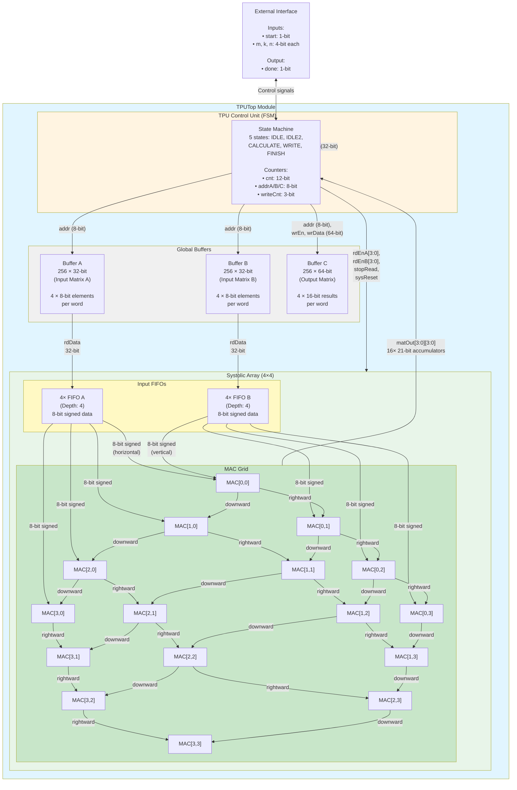
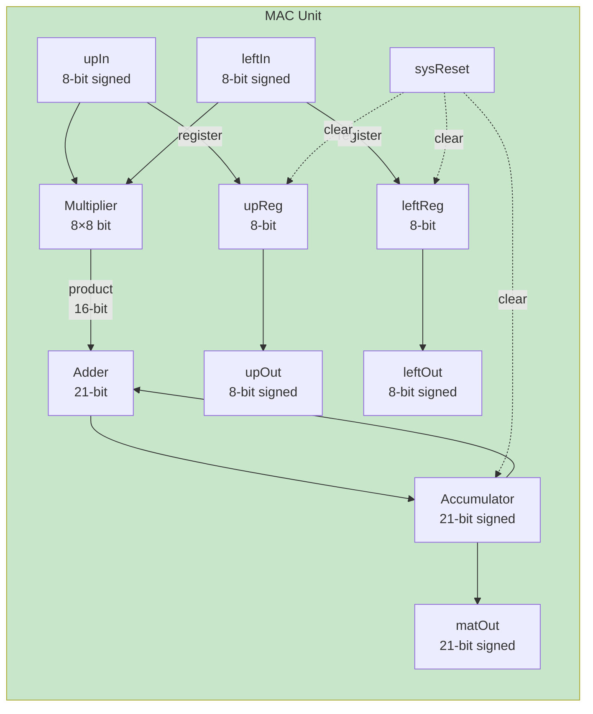
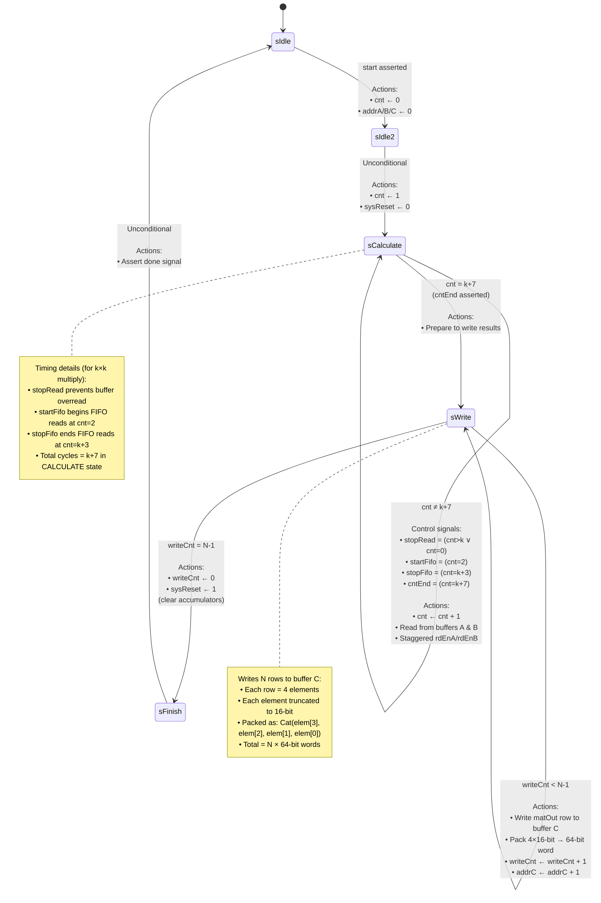
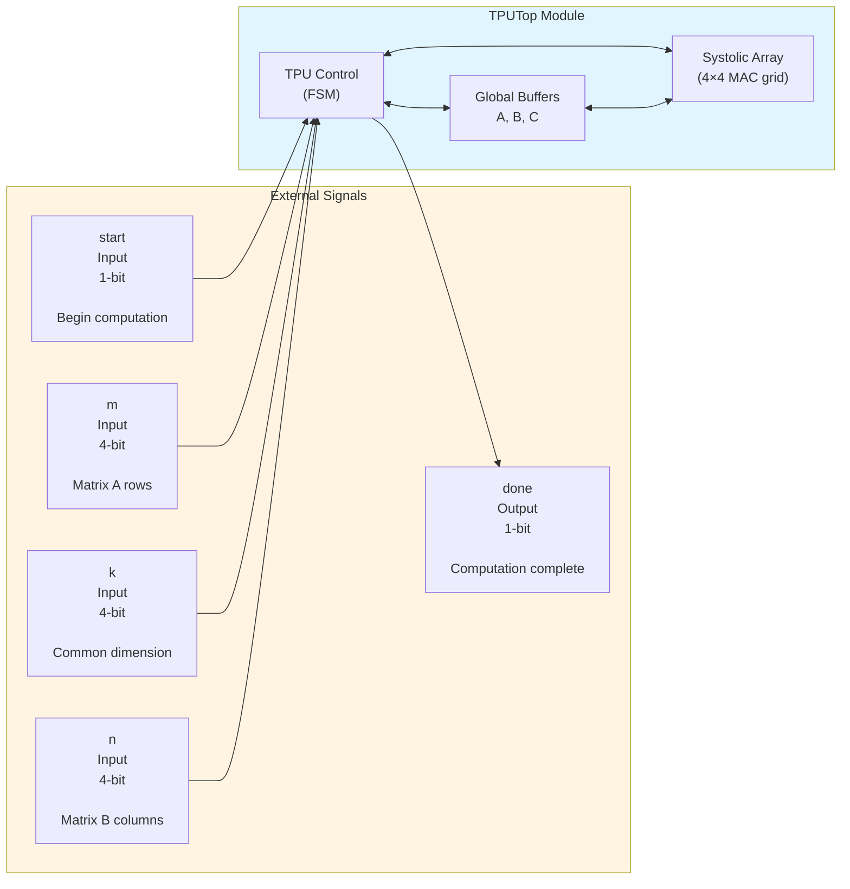

# chisel-tpu

A Tensor Processing Unit (TPU) hardware design implemented in Chisel HDL with parameterized N×N systolic array for matrix multiplication.

## Architecture Overview

### System Architecture Diagram



### MAC Unit Architecture

Each MAC (Multiply-Accumulate) unit contains:
- **Input registers**: 2× 8-bit signed (upReg, leftReg)
- **Accumulator**: 21-bit signed
- **Operation**: `accumulator += upIn × leftIn`
- **Data flow**: Systolic (inputs forwarded to neighboring MACs)



## TPU Control State Machine

The TPUControl FSM orchestrates the entire computation pipeline:



## TPU Interface

### Top-Level Interface (TPUTop)



### Internal Interfaces

#### Global Buffer Interface (GlobalBufferIO)
```scala
class GlobalBufferIO(config: TPUConfig, wordWidth: Int) {
  wrEn:   Input(Bool())                        // Write enable
  addr:   Input(UInt(bufferAddrWidth.W))       // Address (8-bit for depth=256)
  wrData: Input(UInt(wordWidth.W))             // Write data (32-bit for A/B, 64-bit for C)
  rdData: Output(UInt(wordWidth.W))            // Read data (synchronous)
}
```

#### MAC Interconnect Interface
```scala
class MACInterconnect(dataWidth: Int) {
  upIn:    Input(SInt(dataWidth.W))            // Vertical input (8-bit signed)
  leftIn:  Input(SInt(dataWidth.W))            // Horizontal input (8-bit signed)
  upOut:   Output(SInt(dataWidth.W))           // Vertical output (forwarded)
  leftOut: Output(SInt(dataWidth.W))           // Horizontal output (forwarded)
}
```

#### Systolic Array Interface
```scala
class SystolicArrayIO {
  matrixAData: Input(UInt(32.W))               // Packed 4×8-bit values for matrix A
  matrixBData: Input(UInt(32.W))               // Packed 4×8-bit values for matrix B
  stopRead:    Input(Bool())                   // Stop reading from buffers
  rdEnA:       Input(Vec(4, Bool()))           // Read enable for each FIFO A (staggered)
  rdEnB:       Input(Vec(4, Bool()))           // Read enable for each FIFO B (staggered)
  sysReset:    Input(Bool())                   // Reset accumulators
  matOut:      Output(Vec(4, Vec(4, SInt(21.W)))) // 4×4 matrix of 21-bit accumulators
}
```

#### FIFO Interface (SyncFIFOIO)
```scala
class SyncFIFOIO(dataWidth: Int) {
  wrEn:    Input(Bool())                       // Write enable
  rdEn:    Input(Bool())                       // Read enable
  dataIn:  Input(SInt(dataWidth.W))            // Input data (8-bit signed)
  dataOut: Output(SInt(dataWidth.W))           // Output data (synchronous)
  empty:   Output(Bool())                      // FIFO empty flag
  full:    Output(Bool())                      // FIFO full flag
}
```

## Key Parameters (Default Configuration)

| Parameter | Value | Description |
|-----------|-------|-------------|
| N (array size) | 4 | Systolic array dimension (4×4 grid) |
| dataWidth | 8 bits | Input element width (signed) |
| accWidth | 21 bits | Accumulator width (signed) |
| wordWidth | 32 bits | Buffer A/B word width (4×8-bit) |
| extendedWordWidth | 64 bits | Buffer C word width (4×16-bit) |
| bufferDepth | 256 words | Global buffer capacity |
| bufferAddrWidth | 8 bits | Address bus width |
| fifoDepth | 4 entries | FIFO capacity per channel |

## Data Flow

1. **Load Phase**: Matrices A and B are pre-loaded into global buffers (external process)
2. **Start**: Assert `start` signal with dimensions m, k, n
3. **Calculate**:
   - Control FSM reads from buffers A and B (32-bit words)
   - Data unpacked into 4×8-bit elements
   - FIFOs buffer data for systolic array
   - Staggered read enables create wave-front data flow
   - MAC units perform multiply-accumulate operations
   - Computation takes k+7 cycles
4. **Write**:
   - Results from 16 MAC accumulators (21-bit each)
   - Truncated to 16-bit per element
   - Packed as 64-bit words (4 elements per word)
   - Written to buffer C (4 words for 4×4 result)
5. **Done**: `done` signal asserted, FSM returns to idle

## Systolic Data Flow Timing

For a k×k inner dimension multiply:
- **Cycle 0**: Start signal, enter IDLE2
- **Cycle 1**: Enter CALCULATE, cnt=1
- **Cycle 2**: Start FIFO reads (startFifo)
- **Cycle k+3**: Stop FIFO reads (stopFifo)
- **Cycle k+7**: Enter WRITE state (cntEnd)
- **Cycle k+8 to k+11**: Write 4 rows to buffer C
- **Cycle k+12**: Enter FINISH, assert done

## Building and Testing

See [CLAUDE.md](CLAUDE.md) for build commands and project structure.
